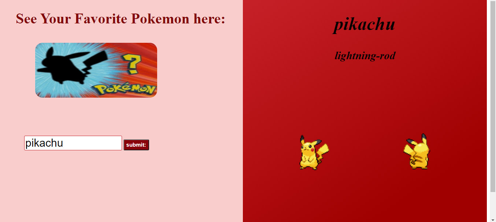

# 📊 Project: Simple API 1

### Goal: Display data returned from an api

Build an application that enables the use of a public API to generate a response with the APIs content.

###  My Simple API Project
This project highlights my use of HTML, CSS and javaScript;a user friendly applcation displays a diverse selection of pokemn made avaiable to the user with their input. 
**Link to project: https://ddsimpleapi.netlify.app/ 

## How It's Made:

**Tech used:** HTML, CSS, JavaScript

I utilized my skills in javaScript, HTML and CSS to include the use of API's into my functions, event listeners, and more: the utilization of these allowed me to make a user interactive pokemon generator. The user is able to search through this interface and get their desried choice returned.

## Lessons Learned:
I learned how to read and include paremeters into my javaScript when using API's